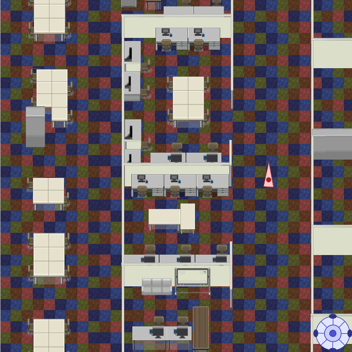

 
  

<h1 align="center"> FUN Explorer </h1>
<h3 align="center"> 情報表現入門Ⅰ(2021年前期) - 公立はこだて未来大学 </h3>

 
  

## ソフトの概要
このアプリは、パソコン上で公立はこだて未来大学の中を2Dで探索できるアプリです。食堂や講堂などの一部の場所を除くほぼすべての場所を探検することができます。8方向に向きを変えることができる三角形のプレイヤーを操作して探索を行います。また、壁やオブジェクトにできるだけ当たり判定を追加したため、よりリアリティを感じることができるようになっています。

## 操作方法
- 画面右下にあるコントローラーをマウスで操作することにより、プレイヤーを移動することができます。

## ゲームの紹介動画

次のリンクからゲームの紹介動画を見ることができます。
[https://youtu.be/k4SLyvW7P2Y?si=-nqz-PI-V29mR3XM](https://youtu.be/mzxtVKW07x8?si=5FKo5FUbwpudawGJ)

## ゲームのプレイ方法
- processing言語の[公式サイト](https://processing.org/download)からprocessingをダウンロードしてインストールします。
- このリポジトリをダウンロードします。
- processingを起動して、ダウンロードしたpdeファイルを開きます。
- 実行ボタンを押してゲームを開始します。
